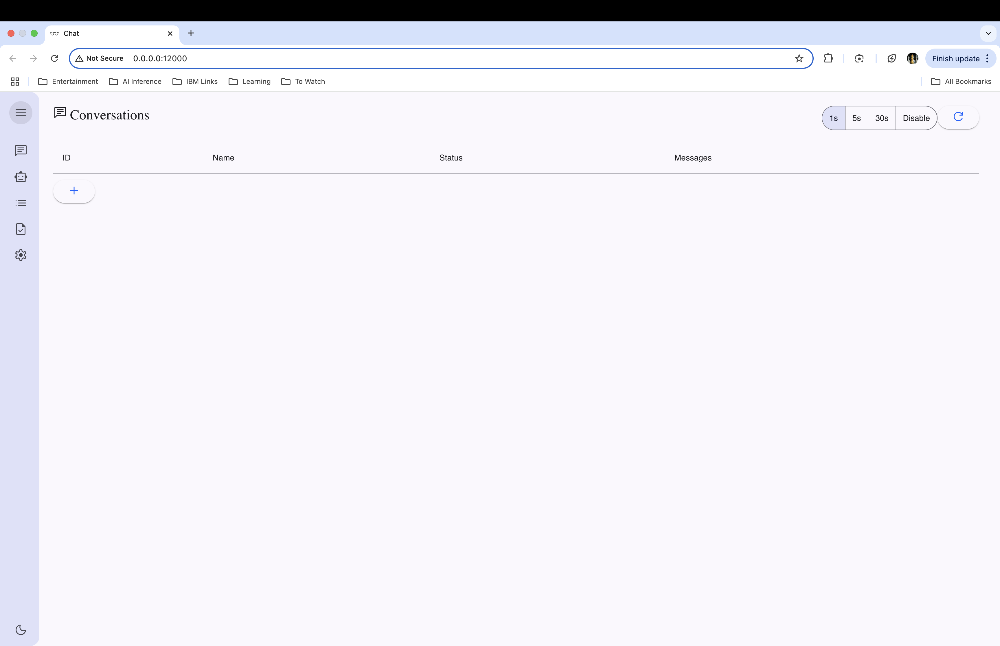
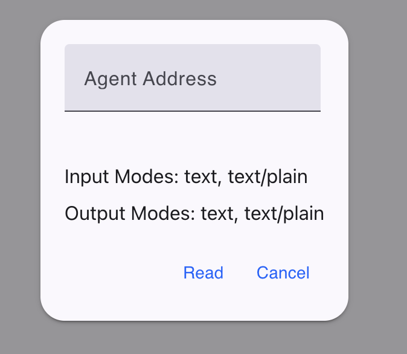
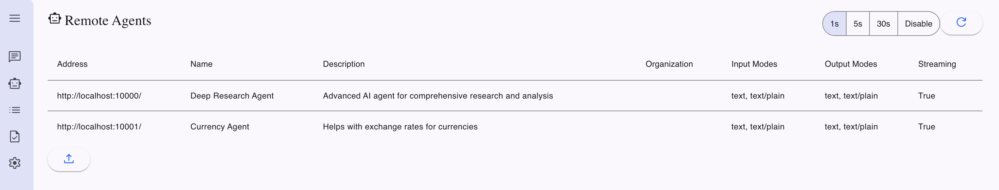
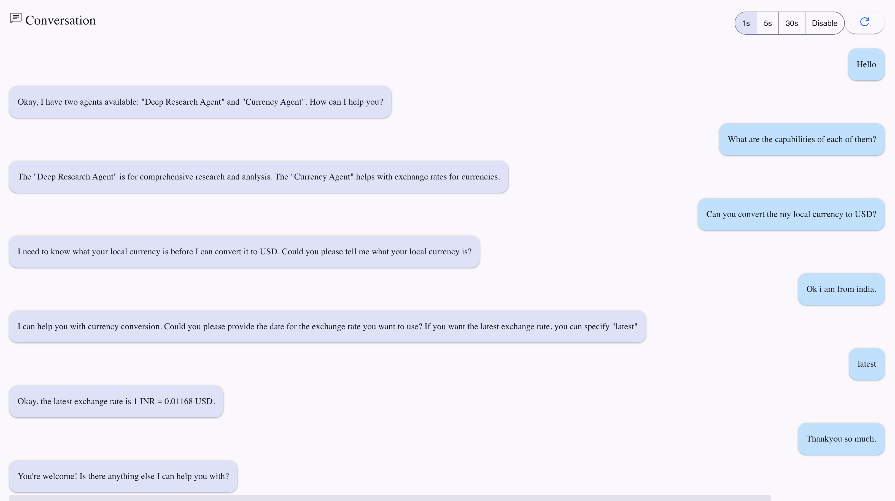
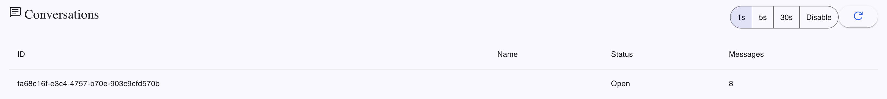
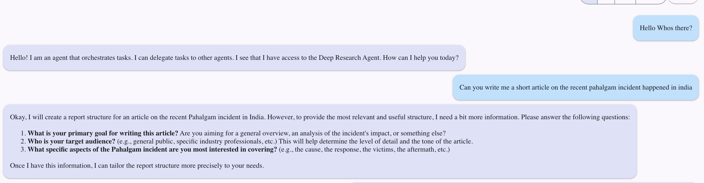
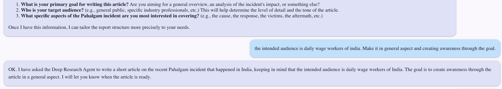
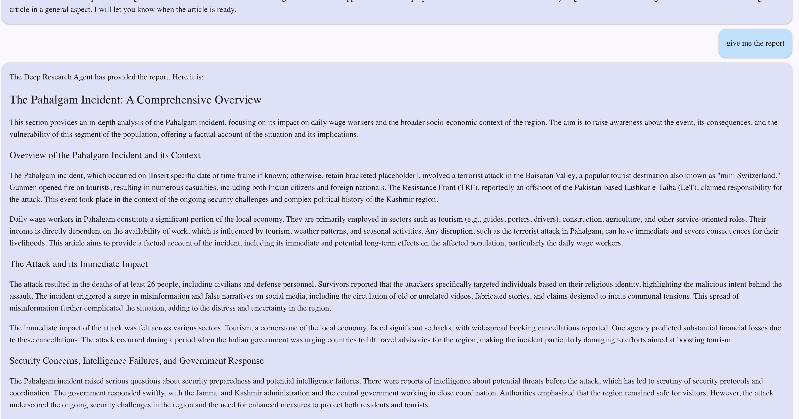

# A2A MCP Demonstration

A comprehensive implementation of Google's Agent-to-Agent (A2A) framework using Model Context Protocol (MCP) tools. This project showcases the interoperability between different AI agents and demonstrates practical applications of modern AI agent architectures.

## Technical Background

### Google A2A Framework

The Agent-to-Agent (A2A) framework is Google's vision for enabling seamless communication and collaboration between different AI agents. It aims to create a network of specialized agents that can work together to solve complex tasks by:
- Sharing context and knowledge
- Delegating tasks to specialized agents
- Maintaining consistent state across interactions
- Handling asynchronous communication

### Model Context Protocol (MCP)

MCP is a protocol designed for efficient communication between AI agents. It enables:
- Structured data exchange
- Context preservation
- Tool integration
- State management
- Error handling and recovery

### LangGraph

LangGraph is a powerful framework for building AI agents using LangChain. It provides:
- Modular component architecture
- Easy integration with LLMs
- Tool orchestration capabilities
- State management
- Customizable workflows

### Deep Research Capabilities

The project implements a research agent inspired by OpenAI's Deep Research capabilities, featuring:
- Multi-step research processes
- Web data analysis and synthesis
- Professional-grade report generation
- Autonomous information gathering
- Context-aware reasoning

## Project Components

This project showcases two distinct LangGraph-based agents:

1. **Deep Research Agent**
   - Implements sophisticated research capabilities
   - Uses modern LLMs for analysis and synthesis
   - Generates well-cited research reports
   - Performs multi-step reasoning
   - Integrates with web data sources

2. **Currency Converter Agent**
   - React-based user interface
   - Real-time currency conversion
   - MCP tool integration
   - Simple demonstration of agent communication
   - Practical use case for agent interoperability

## Project Architecture

The system is built using a client-server architecture with MCP protocol handling communication between components. Each agent is implemented using LangGraph, providing a modular and extensible design that can be easily adapted for other use cases.

The deep research agent leverages modern AI models for sophisticated analysis, while the currency converter demonstrates practical MCP tool integration in a real-world application.

---

## Demo

Below are some screenshots demonstrating the UI and workflow of the project:

### Welcome Page


### Adding a New Agent


### Agents Available


### Currency Conversion Example(MCP) in Action


[🔗 View LangSmith Agent Trace for Currency Conversion Example](https://smith.langchain.com/public/eb8a00ad-731d-4ce5-a0a1-0af71e863154/r))

### Conversations List


### Greetings Example


### Research Question Submission


### Research Clarification Step


### Final Report Generated


[🔗 View LangSmith Agent Trace for Research Report Generation](https://smith.langchain.com/public/24380b0a-d779-41dc-8c88-b6f61da41b39/r)
---

## Key Features

- Implementation of two distinct LangGraph-based agents
- MCP protocol integration for agent communication
- React-based UI for currency converter agent
- Deep research capabilities using modern AI models
- Modular architecture for easy extension
- Demonstration of agent interoperability
- Practical use cases for MCP protocol
- Integration with multiple AI models and tools

## Getting Started

### Prerequisites

- Python 3.12 or higher
- Poetry (dependency management)

### Installation

1. Clone the repository
2. Install dependencies:
```bash
poetry install
```
3. After installing dependencies, create a `.env` file and fill in your API keys.

```env
LANGSMITH_API_KEY=lsv2_...  # Optional, for LangSmith tracing
GOOGLE_API_KEY=...
TAVILY_API_KEY=...
```

- `GOOGLE_API_KEY`: Required for Gemini LLM inference (Gemini 2.0 Flash Lite).
- `TAVILY_API_KEY`: Required for Tavily search tool.
- `LANGSMITH_API_KEY`: (Optional) For enabling LangSmith/LangGraph tracing.

> **Note:** LangSmith tracing is optional but recommended for debugging and visualizing agent traces.

### Running the Project

1. Start the Deep Research Agent:
```bash
poetry run python src/a2a_server/deep_research/main.py --port 10000
```

2. Start the Currency Converter Agent (also starts MCP server):
```bash
poetry run python src/a2a_server/currency_convertor/main.py --port 10001
```

3. Start the A2A Client:
```bash
poetry run python src/a2a_client/main.py
```

## Project Structure

```
a2a_mcp/
├── src/
│   ├── a2a_client/        # A2A client implementation
│   ├── a2a_server/        # Server-side agents
│   │   ├── deep_research/ # Deep research agent implementation
│   │   └── currency_convertor/ # Currency converter agent
│   └── mcp_server/        # MCP server implementation
├── images/                # Demo screenshots
├── logs/                  # Application logs
└── tests/                 # Test files
```

## Technical Details

### Agent Communication

Agents communicate using the MCP protocol, which handles:
- Message serialization/deserialization
- Context management
- Error handling
- State synchronization
- Tool invocation

### Deep Research Implementation

- **LLM Model:** All LLM inference in this project uses the `gemini-2.0-flash-lite` model from Google.
- **Token Usage Warning:** The Deep Research agent may make multiple LLM calls per query (for multi-step reasoning and reflection). Please be aware of potential token usage and associated costs.

The deep research agent uses a pipeline approach:
1. Query analysis and planning
2. Web data collection
3. Information synthesis
4. Report generation
5. Result presentation

### Currency Converter Architecture

The currency converter demonstrates:
- Real-time data fetching
- MCP tool integration
- Simple UI implementation
- Agent communication patterns

## Usage

The project can be used to:
1. Demonstrate agent-to-agent communication
2. Test MCP protocol implementation
3. Experiment with different agent architectures
4. Develop new agents using the provided framework
5. Understand A2A framework concepts
6. Learn MCP protocol implementation
7. Build AI-powered research tools

## Contributing

Contributions to improve this project are welcome. Please feel free to submit a Pull Request.

## License

This project is licensed under the MIT License file for details.

## Acknowledgments

- Google's A2A Framework
- LangGraph
- MCP Protocol Team
- [psykick-21/deep-research](https://github.com/psykick-21/deep-research) for inspiration and reference for the Deep Research agent implementation

## References

- [Google A2A Framework Documentation](https://github.com/google/A2A)
- [LangGraph Documentation](https://langchain-ai.github.io/docs/langgraph/)
- [MCP Protocol Specification](https://modelcontextprotocol.io/introduction)

## Contact

For any queries or suggestions, please open an issue in the GitHub repository.

---

<p align="center"><sub>Made with ❤️ using <a href="https://windsurf.com">Windsurf</a>.</sub></p>