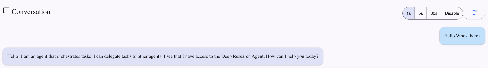

# Agent2Agent (A2A) and MCP Demonstration

This project serves as a practical demonstration of Google's Agent2Agent (A2A) protocol, showcasing the interaction between a user, an A2A Client (Client Agent), and multiple A2A Servers hosting different Remote Agents. It also illustrates the integration of the Model Context Protocol (MCP) by having one of the Remote Agents interact with tools exposed via an MCP Server.

## Project Overview

The core of this project revolves around the A2A protocol, enabling seamless communication and task delegation between different autonomous agents. This addresses a critical challenge in the AI landscape: allowing agents built on diverse frameworks by different companies running on separate servers to communicate and collaborate effectively. The setup includes:

1. **User**: Interacts with the system via a web-based frontend built with Mesop.

2. **A2A Client (Client Agent)**: A central agent built using the Google ADK framework. It acts as an orchestrator, receiving user requests from the frontend. It utilizes the A2A protocol's discovery mechanism (via Agent Cards) to identify the capabilities of available Remote Agents and intelligently routes the user's request to the most suitable agent.

3. **A2A Server**: An HTTP endpoint that implements the A2A protocol methods, receiving requests from the A2A Client and managing task execution by the Remote Agents it hosts.

4. **Remote Agents**: Specialized agents hosted on the A2A Server, capable of performing specific tasks. This project demonstrates two distinct Remote Agents.

5. **MCP Server**: (Used by one of the Remote Agents) Implements the Model Context Protocol, providing a standardized way for AI models and agents to interact with external tools, data sources, and systems. It abstracts access to specific tools, providing a standardized interface (`list_tools`, `call_tool`) for agents to interact with them without needing to understand the tool's internal implementation.

The user interacts with the A2A Client through a Mesop web application, which visualizes the conversation flow and the interactions between the user, the Client Agent, and the Remote Agents.

## Architecture and Flow

The project demonstrates a typical A2A interaction flow, enhanced by the integration of MCP:

1. **Remote Agent Startup**: The Remote Agents (Currency Convertor and Deep Research) are started. As part of their initialization, they expose their capabilities and skills through `AgentCard`s, which are public metadata files describing the agent's functionality, endpoint, and other relevant information.

2. **Client Agent Discovery**: The A2A Client application is started. It discovers the available Remote Agents by fetching their `AgentCard`s, allowing it to understand their capabilities and how to interact with them.

3. **User Interaction**: The user enters a query into the Mesop web UI.

4. **Request Routing (A2A Client)**: The A2A Client receives the user's query. Based on the capabilities described in the attached `AgentCard`s, the Client Agent determines which Remote Agent is best equipped to handle the request and forwards the query using the A2A protocol's `tasks/send` or `tasks/sendSubscribe` methods.

5. **Remote Agent Execution**: The selected Remote Agent receives the query via the A2A Server.
   - **Currency Convertor Agent**: The Currency Convertor Agent, built using the Langgraph framework, processes the request. To get real-time exchange rates, it interacts with a currency conversion tool hosted on an MCP Server. It uses the standardized `list_tools` to discover available tools and `call_tool` to invoke the specific currency conversion functionality provided by the MCP Server. This interaction demonstrates how A2A agents can leverage external capabilities exposed via MCP.
   - **Deep Research Agent**: The Deep Research Agent, also built with the Langgraph framework, executes its internal research workflow. Langgraph's graph-based structure allows defining complex, stateful interactions and decision-making processes required for comprehensive research.

6. **Response**: The Remote Agent processes the query and sends the result back to the A2A Client via the A2A Server. This response can include structured data (Artifacts) or messages.

7. **Display (Frontend)**: The A2A Client updates the Mesop UI to display the response received from the Remote Agent to the user, completing the interaction cycle.

This architecture effectively demonstrates how the A2A protocol facilitates agent discovery and interaction across different services, while the integration with MCP shows how agents can leverage external tools in a standardized and modular manner.

## Components

* **Mesop Frontend**: A web application providing the user interface for interacting with the A2A Client. It displays the conversation history, agent responses, and potentially visualizes the agent interactions.

* **A2A Client (Client Agent)**: 
   - Built with the Google ADK framework, which simplifies the development of agents that adhere to the A2A protocol.
   - Manages conversations with the user, maintaining state and context.
   - Discovers and attaches to Remote Agents based on their AgentCards.
   - Intelligently routes user queries to the appropriate Remote Agent based on their advertised skills and capabilities.

* **A2A Server**: 
   - Hosts the Remote Agents, making them accessible to A2A Clients.
   - Handles incoming A2A requests and manages the lifecycle of tasks assigned to the Remote Agents.

* **Remote Agents**:

   * **Currency Convertor Agent**:

      - Implemented using the Langgraph framework, enabling the definition of a stateful workflow for currency conversion requests.
      - Specializes in currency conversion tasks.
      - Interacts with an MCP Server to access a real-time currency conversion tool using the standardized MCP tool interfaces.

   * **Deep Research Agent**:

      - Implemented using the Langgraph framework to define and manage a complex, multi-step research process.
      - Designed to perform in-depth research based on user queries, potentially involving multiple steps like information gathering, synthesis, and summarization.
      - Its internal workflow nodes are included in this repository, showcasing a practical application of Langgraph.

* **MCP Server**:

   - Hosts the actual currency conversion tool.
   - Provides a standardized interface (`list_tools()`, `call_tool()`) based on the Model Context Protocol specification, allowing the Currency Convertor Agent to access its functionality without direct API integration.

## Technologies Used

* **Google Agent2Agent (A2A) Protocol**: An open protocol enabling communication and interoperability between opaque agentic applications. It defines how agents discover each other's capabilities, negotiate interaction modalities, securely collaborate on tasks, and exchange various forms of content.

* **Google Agent Development Kit (ADK)**: A framework that simplifies building agents compliant with the A2A protocol.

* **Model Context Protocol (MCP)**: An open standard for connecting AI assistants to external systems, data sources, and tools. It standardizes how models can access context and perform actions via tools, providing a universal plug-and-play format.

* **Mesop**: A Python-based UI framework used to build the web frontend for the A2A Client, providing a user-friendly interface for interaction.

* **Langgraph**: A library built on top of LangChain that allows building stateful, multi-actor applications with LLMs. It uses a graph-based approach to define complex workflows with cycles, essential for creating sophisticated agent runtimes that can involve iterative processes and decision points.

* **Python**: The primary programming language used for developing the A2A Client, A2A Server, Remote Agents, and MCP Server components.

## A2A and MCP: Complementary Protocols
This project highlights the synergy between A2A and MCP. A2A focuses on agent-to-agent communication and collaboration, enabling different agents to discover and interact with each other. MCP, on the other hand, standardizes how an individual agent (or model) interacts with external tools and data sources.

In this project, the A2A protocol is used for the Client Agent to communicate with the Remote Agents. The MCP is used by the Currency Convertor Remote Agent to interact with the specific currency conversion tool. This demonstrates a powerful pattern where A2A enables a multi-agent system, and within that system, individual agents can leverage MCP to access external capabilities.

## Project Structure
```
.
├── README.md
├── src/
│   ├── a2a_client/         # Code for the A2A Client (Mesop UI, ADK client logic)
│   │   ├── components/
│   │   ├── pages/
│   │   ├── service/
│   │   ├── state/
│   │   ├── styles/
│   │   ├── tests/
│   │   ├── utils/
│   │   └── main.py
│   ├── a2a_server/         # Code for the A2A Server and Remote Agents
│   │   ├── currency_convertor/ # Currency Convertor Agent (Langgraph)
│   │   │   ├── agent.py
│   │   │   ├── main.py
│   │   │   └── task_manager.py
│   │   └── deep_research/    # Deep Research Agent (Langgraph)
│   │       ├── components/
│   │       ├── agent.py
│   │       ├── main.py
│   │       └── task_manager.py
│   └── mcp_server/         # Code for the MCP Server
│       └── server.py
└── ... (other potential files/directories)


```


## Getting Started

### Prerequisites

- Python 3.12 or higher
- Poetry (dependency management)

### Installation

1. Clone the repository
2. Install dependencies:
```bash
poetry install
```
3. After installing dependencies, create a `.env` file and fill in your API keys.

```env
LANGSMITH_API_KEY=lsv2_...  # Optional, for LangSmith tracing
GOOGLE_API_KEY=...
TAVILY_API_KEY=...
```

- `GOOGLE_API_KEY`: Required for Gemini LLM inference (Gemini 2.0 Flash Lite).
- `TAVILY_API_KEY`: Required for Tavily search tool.
- `LANGSMITH_API_KEY`: (Optional) For enabling LangSmith/LangGraph tracing.

> **Note:** LangSmith tracing is optional but recommended for debugging and visualizing agent traces.

> **LLM Model:** All LLM inference in this project uses the gemini-2.0-flash-lite model from Google.

> **Token Usage Warning:** The Deep Research agent may make multiple LLM calls per query (for multi-step reasoning and reflection). Please be aware of potential token usage and associated costs.

### Running the Project

1. Start the Deep Research Agent:
```bash
poetry run python src/a2a_server/deep_research/main.py --port 10000
```

2. Start the Currency Converter Agent (also starts MCP server):
```bash
poetry run python src/a2a_server/currency_convertor/main.py --port 10001
```

3. Start the A2A Client:
```bash
poetry run python src/a2a_client/main.py
```

## Usage
Once the A2A Client Mesop application is running, open your web browser and navigate to the address provided by the Mesop server (usually `http://localhost:12000`).
* The UI should display the available agents (Currency Convertor and Deep Research), which the client has discovered using their AgentCards.
* Enter your queries in the chat interface provided by the Mesop app.
* The A2A Client will route your query to the appropriate agent based on its analysis of the query and the agents' capabilities.
* The response from the selected Remote Agent will be displayed in the conversation interface.

Try asking questions like:
* "Convert USD to INR" (This should be handled by the Currency Convertor Agent)
* "Tell me about the history of artificial intelligence." (This should be handled by the Deep Research Agent)
* "What is the current exchange rate between JPY and CAD?" (Another query for the Currency Convertor)
* "Summarize the key findings on the impact of climate change on polar bears." (Another query for the Deep Research Agent)

Observe how the A2A Client correctly identifies and utilizes the specialized Remote Agents to fulfill different types of requests.

## Demo

Below are some screenshots demonstrating the UI and workflow of the project:

### Welcome Page


### Adding a New Agent


### Agents Available


### Currency Conversion Example(MCP) in Action


[🔗 View LangSmith Agent Trace for Currency Conversion Example](https://smith.langchain.com/public/eb8a00ad-731d-4ce5-a0a1-0af71e863154/r))

### Conversations List


### Greetings Example


### Research Question Submission


### Research Clarification Step


### Final Report Generated


[🔗 View LangSmith Agent Trace for Research Report Generation](https://smith.langchain.com/public/24380b0a-d779-41dc-8c88-b6f61da41b39/r)

### Deep Research Langgraph Agentic Pattern

---

To know more about the repo use: [](https://deepwiki.com/Kirushikesh/a2a-deep-research)

## Contributing

Contributions to improve this project are welcome. Please feel free to submit a Pull Request.

## License

This project is licensed under the MIT License file for details.

## Acknowledgments

- Google's A2A Framework
- Google's ADK
- LangGraph
- MCP Protocol Team
- [psykick-21/deep-research](https://github.com/psykick-21/deep-research) for inspiration and reference for the Deep Research agent implementation

## References

- [Google A2A Framework Documentation](https://github.com/google/A2A)
- [LangGraph Documentation](https://langchain-ai.github.io/docs/langgraph/)
- [MCP Protocol Specification](https://modelcontextprotocol.io/introduction)

## Contact

For any queries or suggestions, please open an issue in the GitHub repository.

---

<p align="center"><sub>Made with ❤️ using <a href="https://windsurf.com">Windsurf</a>.</sub></p>